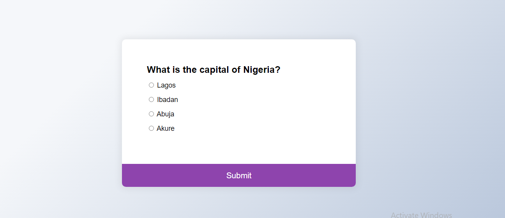
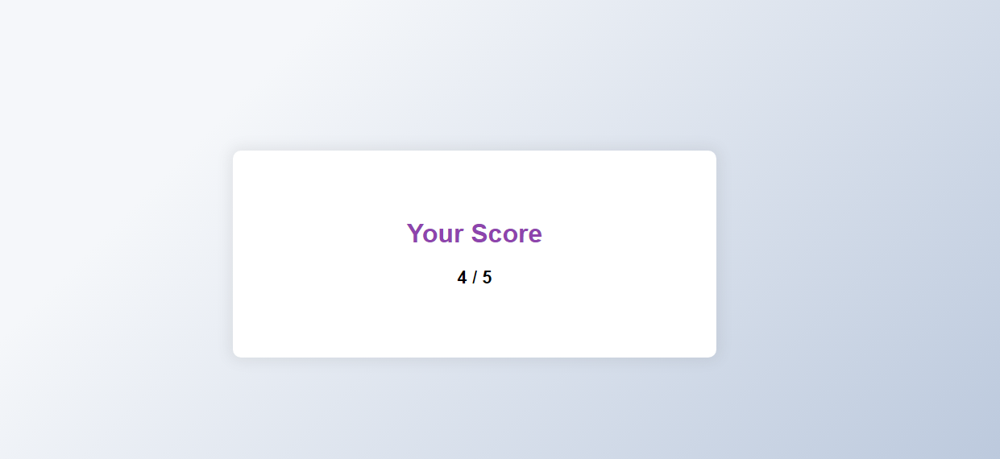

<h1>Quiz Application</h1>

Simple quiz application made with javascript

<h2>Neat Interface</h2>

<h4>Quiz Score</h4>

 

<h2>Usage</h2>

Git clone: To clone the repository

Open with your favourite IDE

 

<h2>Live Demo</h2>
<a target="_blank" href="https://davidolaoluwa360.github.io/quiz-app/">View Quiz Application</a>